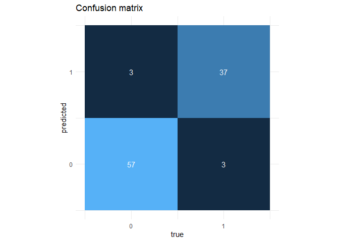

Logistic Regression
================
Anders Poirel
06-23-2019

*More practice in R, especially learning how to do stuff in the
tidyverse.*

``` r
library(tidyverse)
```

we want to build a model predicting whether a customer opened a
promotional email Read the data:

``` r
data <- read_csv("P12-Email-Offer.csv")
```

We have a sample of a 100 customers, and for each of them age, gender
and whether they opned the email

``` r
print(data)
```

    ## # A tibble: 100 x 3
    ##      Age Gender TookAction
    ##    <dbl> <chr>       <dbl>
    ##  1    38 Female          0
    ##  2    32 Female          0
    ##  3    46 Male            1
    ##  4    34 Male            0
    ##  5    40 Male            0
    ##  6    37 Female          0
    ##  7    43 Male            1
    ##  8    38 Male            1
    ##  9    27 Male            0
    ## 10    42 Female          0
    ## # ... with 90 more rows

This is a classification problem in with only two possible categories -
the customer opens the email (1) or doesn’t (0). A logistic regression
model may thus be appropriate for this
problem:

``` r
lr_model <- glm(TookAction ~ Age + Gender, data = data, family = binomial)
summary(lr_model)
```

    ## 
    ## Call:
    ## glm(formula = TookAction ~ Age + Gender, family = binomial, data = data)
    ## 
    ## Deviance Residuals: 
    ##      Min        1Q    Median        3Q       Max  
    ## -1.96524  -0.09857  -0.00566   0.09864   2.67479  
    ## 
    ## Coefficients:
    ##             Estimate Std. Error z value Pr(>|z|)    
    ## (Intercept) -38.1520     9.9869  -3.820 0.000133 ***
    ## Age           0.8872     0.2318   3.828 0.000129 ***
    ## GenderMale    4.4374     1.4919   2.974 0.002937 ** 
    ## ---
    ## Signif. codes:  0 '***' 0.001 '**' 0.01 '*' 0.05 '.' 0.1 ' ' 1
    ## 
    ## (Dispersion parameter for binomial family taken to be 1)
    ## 
    ##     Null deviance: 134.602  on 99  degrees of freedom
    ## Residual deviance:  29.613  on 97  degrees of freedom
    ## AIC: 35.613
    ## 
    ## Number of Fisher Scoring iterations: 8

We use the fitted model to find the predicted values for the original
dataset. To obtain 0-1 values instead of probabilities, we predict 1 for
probabilities \>= 0.5 and 0 otherwise.

``` r
preds <- predict(lr_model, type = "response")
preds <- if_else(preds >= 0.5, 1, 0)
```

Use these predictions to compute the number of true positives and
negatives, and of false positive and negatives:

``` r
t_pos <- sum(if_else(data$TookAction == 1 & preds == 1, 1, 0))
t_neg <- sum(if_else(data$TookAction == 0 & preds == 0, 1, 0))
f_pos <- sum(if_else(data$TookAction == 0 & preds == 1, 1, 0))
f_neg <- sum(if_else(data$TookAction == 1 & preds == 0, 1, 0))
```

We can now visualize the model’s predictions as follows:

``` r
coeffs <- c(t_neg, f_neg, f_pos, t_pos) 
tr <- c(0, 1, 0, 1) # values used to build confusion matrix
pr <- c(0, 0, 1, 1) 

confusion_m <- ggplot(mapping = aes(x = tr, y = pr, fill = coeffs)) + 
  geom_tile() +
  geom_text(mapping = aes(label = coeffs), color = "white") +
  guides(fill = F) +
  coord_equal() +
  labs(title = "Confusion matrix", x = "true", y = "predicted") +
  scale_x_continuous(breaks = c(0,1)) +
  scale_y_continuous(breaks = c(0,1)) +
  theme_minimal()
  
confusion_m
```

<!-- -->
