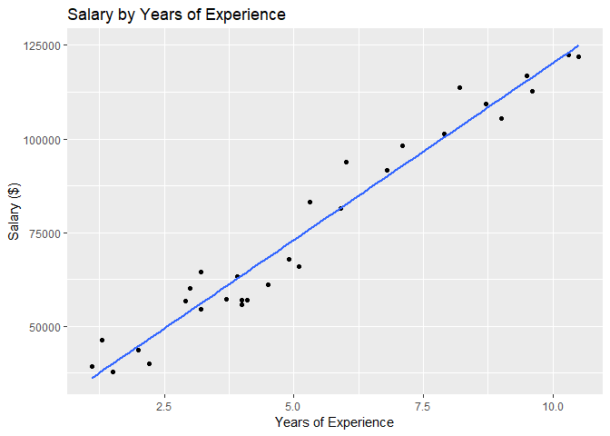

Predicting Salaries by Level of Experience
================
Anders Poirel

*I thought it would be interesting to redo exercises from the online course Data Science AZ more thouroughly in R*

We load the data:

``` r
library(ggplot2)
saldata <- read.csv('SalaryData.csv')
```

Examine descriptive statistics for data:

``` r
summary(saldata)
```

    ##  YearsExperience      Salary      
    ##  Min.   : 1.100   Min.   : 37731  
    ##  1st Qu.: 3.200   1st Qu.: 56721  
    ##  Median : 4.700   Median : 65237  
    ##  Mean   : 5.313   Mean   : 76003  
    ##  3rd Qu.: 7.700   3rd Qu.:100545  
    ##  Max.   :10.500   Max.   :122391

Fit the linear regression model and view statistics for the model:

``` r
fm_exp <- lm(saldata$Salary ~ saldata$YearsExperience, saldata)
summary(fm_exp)
```

    ## 
    ## Call:
    ## lm(formula = saldata$Salary ~ saldata$YearsExperience, data = saldata)
    ## 
    ## Residuals:
    ##     Min      1Q  Median      3Q     Max 
    ## -7958.0 -4088.5  -459.9  3372.6 11448.0 
    ## 
    ## Coefficients:
    ##                         Estimate Std. Error t value Pr(>|t|)    
    ## (Intercept)              25792.2     2273.1   11.35 5.51e-12 ***
    ## saldata$YearsExperience   9450.0      378.8   24.95  < 2e-16 ***
    ## ---
    ## Signif. codes:  0 '***' 0.001 '**' 0.01 '*' 0.05 '.' 0.1 ' ' 1
    ## 
    ## Residual standard error: 5788 on 28 degrees of freedom
    ## Multiple R-squared:  0.957,  Adjusted R-squared:  0.9554 
    ## F-statistic: 622.5 on 1 and 28 DF,  p-value: < 2.2e-16

Plots the data and the regression line using ggplot:

``` r
ggplot(saldata, aes(x = saldata$YearsExperience, y = saldata$Salary)) + geom_point() +
  labs(title = "Salary by Years of Experience", x ="Years of Experience", y= "Salary ($)") +
  stat_smooth(method= "lm", se = FALSE) 
```


